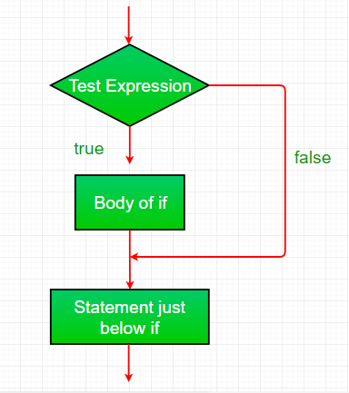
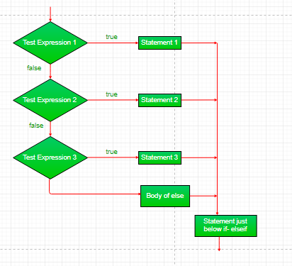

# <p align=center><b>IF-ELSE</b> (Decision maker)</p>

Decision Making in programming is similar to decision making in real life. In programming also we face some situations where we want a certain block of code to be executed when some condition is fulfilled.
<br/>
A programming language uses control statements to control the flow of execution of program based on certain conditions. These  are used to cause the flow of execution to advance and branch based on changes to the state of a program.
<br/>

### Java’s Selection statements:
* [if][1]
* [if-else][2]
* [nested-if][3]
* [if-else-if][4]
* [switch-case][5]
* [jump][6] – break, continue, return

These statements allow you to control the flow of your program’s execution based upon conditions known only during run time.
<br/>

## [**IF**][1]
The statement is the most simple decision making statement. It is used to decide whether a certain statement or block of statements will be executed or not i.e if a certain condition is true then a block of statement is executed otherwise not.

#### Syntax:
```java
if (boolean condition) 
{
   // Execute statements when condition is TRUE
}
```

Here, **condition** after evaluation will be either TRUE or FALSE.
<br/>
if statement accepts boolean values – if the value is TRUE then it will execute the block of statements under it.
<br/>
If we don't provide the *curly braces* **"{"** and **"}"** after **if(***...condition...***)** then by default if statement will consider the immediate **one statement** to be inside its block.

#### Example,
```java
if(condition)
   statement1;  // Execute the statement1 ONLY when condition is TRUE
   statement2;
```

#### Flowchart:


#### Example:
```java
public class IfDecisionMaker
{
    public static void main(String... args)
    {
        int i = 10;
  
        if (i > 15)
            System.out.println(
                "10 is less than 15"    // Output: ...nothing...
            );
  
        System.out.println(
            "I am Not in if"            // Output: I am Not in if
        );
    }
}
```
<br/>

## [IF-ELSE][2]
The if statement alone tells us that if a condition is true it will execute a block of statements and if the condition is false it won’t. But what if we want to do something else if the condition is false. Here comes the else statement. We can use the else statement with if statement to execute a block of code when the condition is false.

#### Syntax:
```java
if (boolean condition) 
{
   ... statement(s) ... // Execute when condition is TRUE
}
else
{
    ... statement(s) ... // Execute when condition is FALSE
}
}
```

### Flowchart:


#### Example:
```java
class IfElse
{
    public static void main(String... args)
    {
        int num = 10;
  
        if (num < 15)
            System.out.println(
                "NUM is smaller than 15" // Output: NUM is smaller than 15
            );
        else
            System.out.println(
                "NUM is greater than 15" // Output: ... nothing ...
            );
    }
}
```
<br/>

## [NESTED-IF][3]
A nested if is an if statement that is the target of another if or else. Nested if statements means an if statement inside an if statement. Yes, java allows us to nest if statements within if statements. i.e, we can place an if statement inside another if statement.

#### Syntax:
```java
if(boolean condition) 
{
   ... statement(s) ...     // Execute when condition is TRUE
   if (boolean condition2) 
   {
      ... statement(s) ...  // Executes when condition2 is TRUE
   }
}
```

### Flowchart:


#### Example:
```java
public class NestedIf
{
    public static void main(String... args)
    {
        int num = 10;
  
        if (num == 10)
        {
            // Will ONLY BE EXECUTED if statement ABOVE it is TRUE
            if (num < 15)
                System.out.println(
                    "NUM is smaller than 15"            // Output: NUM is smaller than 15
                );
  
            if (num < 12)
                System.out.println(
                    "NUM is smaller than 12"            // Output: NUM is smaller than 12
                );
            else
                System.out.println(
                    "NUM is greater than 12 or Equal"   // Output: ... nothing ... 
                );
        }
    }
}
```
<br/>

## [IF-ELSE-IF][4] (*"Ladder"*)
Here, a user can decide among multiple options.The if statements are executed from the top down. As soon as one of the conditions controlling the if is true, the statement associated with that if is executed, and the rest of the ladder is bypassed. If none of the conditions is true, then the final else statement will be executed.

#### Syntax:
```java
if(boolean condition) 
{
   ... statement(s) ...
}
else
   if (boolean condition2) 
   {
      ... statement(s) ...
   }

else
   if (boolean condition3) 
   {
      ... statement(s) ... 
   }

// ... several else-if blocks ...

else
{
    ... statement(s) ...
}
```

### Flowchart:


#### Example:
```java
public class IfElseIf
{
    public static void main(String... args)
    {
        int num = 20;
  
        if (num == 10)
            System.out.println(
                "Num is 10"             // Output: ... noting ...
            );
        else if (num == 15)
            System.out.println(
                "Num is 15"             // Output: ... noting ...
            );
        else if (num == 20)
            System.out.println(
                "Num is 20"             // Output: Num is 20
            );
        else
            System.out.println(
                "Num is not present"    // Output: ... noting ...
            );
    }
}
```
<br/>

## [JUMP][6]
Java supports three jump statement: **break**, **continue** and **return**. These three statements transfer control to other part of the program.
1. [Break][7]  is majorly used for:
   * **Terminate** a sequence in a switch statement.
   * To **exit** a loop.
   * Used as a “civilized” form of **goto**.

<br/>

## Using break to exit a Loop
Using break, we can force immediate termination of a loop, bypassing the conditional expression and any remaining code in the body of the loop.
<br/>
*Note:* Break, when used inside a set of nested loops, will only break out of the innermost

### Flowchart:


#### Example:
```java
public class BreakLoop
{
    public static void main(String... args)
    {
        for ( int i = 0;
                  i < 10;
                  i++)
        {
            if (i == 5)
                break;                  // terminate loop when i is 5.
  
            System.out.println(
                "Value of I is: " + i   // Output: 0, 1, 2, 3, 4
            );
        }

        System.out.println(
            "Loop complete."            // Output: Loop complete.
        );
    }
}
```
<br/>

## Using **break as** a form of **goto**
Java **doesn't have a goto** statement because *it provides a way to branch in an arbitrary and unstructured manner*. Java uses label. A **Label** is use to **identifies a block of code**.

#### Syntax:
```java
label:
{
    ... statement(s)_1... ;
    ... statement(s)_2... ;
        
    // ... several statement blocks ...

    ... statement(s)_N... ;
}
```

Now, **break** statement *can be use to jump out of target block*.
<br/>
> *Note:* You can't break to any label which is not defined for an enclosing block.

#### Syntax:
```java
break label;
```

#### Example:
```java
public class BreakLabe
{
    public static void main(String... args)
    {
        boolean terminate = true;
         
        first:
        {
            second: // ILLEGAL: The label SECOND ISN'T INTRODUCED YET;
            {
                third:
                {
                    System.out.println(
                        "Before the break statement"    // Output: Before the break statement
                    );

                    if (terminate)
                        break second;                   // take the control out of SECOND label
                    
                    System.out.println(
                        "This will never be executed."  // Output: ... never be ...
                    );
                }

                System.out.println(
                    "This will never be executed."      // Output:  ... never be ...
                );
            }
  
            // IMPORTANT!!! HERE IS THE FIRST BLOCK
            System.out.println(
                "This is after second block."           // Output: This is after second block
            );
        }
    }
}
```
<br/>

2. **Continue:** Sometimes it is useful to force an early iteration of a loop. That is, you might want to continue running the loop but stop processing the remainder of the code in its body for this particular iteration. This is, in effect, a goto just past the body of the loop, to the loop’s end. The continue statement performs such an action.
<br/>

### Flowchart:


#### Example:
```java
public class Continue
{
    public static void main(String... args)
    {
        for ( int i = 0;
                  i < 10;
                  i++)
        {
            
            if (i % 2 == 0)
                continue; // All EVEN numbers are skipped
  
            // All ODD numbers will be printed
            System.out.print(
                i + " "     // Output: 1, 3, 5, 7, 9
            );
        }
    }
}
```
<br/>

3. The [return][8] statement is used to explicitly return from a method. That is, it causes a program control to transfer back to the caller of the method.
<br/>

#### Example:
```java
public class Return
{
    public static void main(String... args)
    {
        boolean terminator = true;

        System.out.println(
            "Before the return."    // Output: Before the return
        );
      
        if (terminator) // If TRUE, bypass every statement  
            return;     // after, until the end of the block 

        System.out.println(
            "This won't execute."   // Output: ... nothing ...
        );
    }
}
```
<!--
* [if][1]
* [if-else][2]
* [nested-if][3]
* [if-else-if][4]
* [switch-case][5]
* [jump][6]
* [break][7]
* [return][8]
--> 

[1]: https://www.geeksforgeeks.org/decision-making-javaif-else-switch-break-continue-jump/?ref=lbp#if  
[2]: https://www.geeksforgeeks.org/java-if-else-statement-with-examples/
[3]: https://www.geeksforgeeks.org/decision-making-javaif-else-switch-break-continue-jump/?ref=lbp#nested-if
[4]: https://www.geeksforgeeks.org/java-if-else-if-ladder-with-examples/
[5]: https://github.com/yoricsv/002.1_JDVLAOIS_.git/SwitchCase.md
[6]: https://www.geeksforgeeks.org/decision-making-javaif-else-switch-break-continue-jump/?ref=lbp#jump
[7]: https://www.geeksforgeeks.org/break-statement-in-java/
[8]: https://www.geeksforgeeks.org/return-keyword-java/

---
<br/>