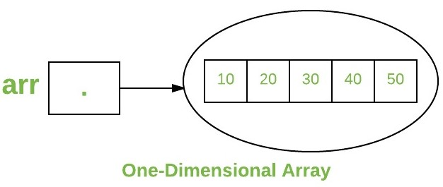
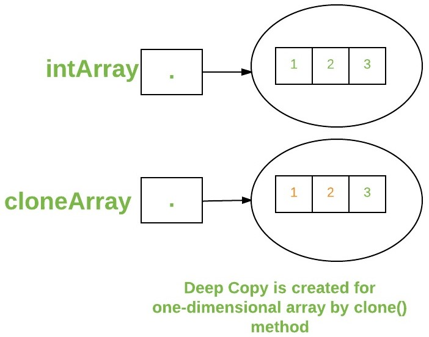
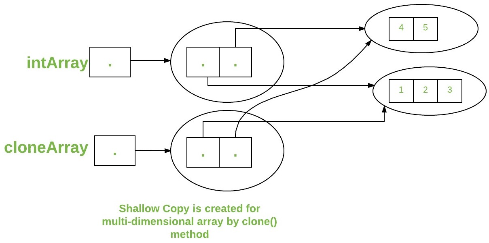

# <p align=center><b>Arrays</b></p> 

* [**Array:**][4] An array is a group of like-typed variables that are referred to by a common name. Arrays in Java work differently than they do in C/C++. The following are some important points about Java arrays. 
   * In Java, all arrays are dynamically allocated.
   * Since arrays are objects in Java, we can find their length using member length. This is different from C/C++ where we find length using size.
   * A Java array variable can also be declared like other variables with [] after the data type.
   * The variables in the array are ordered and each has an index beginning from 0.
   * Java array can be also be used as a static field, a local variable or a method parameter.
   * The size of an array must be specified by an int value and not long or short.
   * The direct superclass of an array type is [Object][1].
   * Every array type implements the interfaces [Cloneable][2] and [java.io.Serializable][3].

Array can contain primitives (*int*, *char* and etc.) as well as object (or non-primitive) references of a *class* depending on the definition of the array.
<br/>In case of **primitive** data types, the actual values are stored **in contiguous memory** locations. 
<br/>In case of objects of a **class**, the actual [objects are stored **in heap**][4] segment.


<br/>

## Creating, Initializing, and Accessing an Array

### **One-Dimensional Arrays:**
The general form of a one-dimensional array declaration is:

#### Syntax (both are valid declarations):
```java
Type varName[]; // C-Style
```

#### or:
```java
Type[] varName; // Java-Style
```

An array declaration has two components: the **type** and the **name**. *Type* declares *the element type* of the array. The element type determines the **data type of each element** that comprises the array. Like an array of integers, we can also create an array of other primitive data types like char, float, double, etc. or user-defined data types (objects of a class). Thus, the **element type** for the array determines **what type of data the array will hold**.

#### Example:
```java
// ARRAYS OF PRIMITIVE DATA TYPES
// numbers
      byte[] byteArray;
     short[] shortsArray;
       int[] intArray;
      long[] longArray;
// floating point
     float[] floatArray;
    double[] doubleArray;
// symbolic
      char[] charArray;
// boolean
   boolean[] booleanArray;

// ARRAYS OF NON-PRIMITIVE DATA TYPES (create by user)
// classes (objects)
   MyClass[] myClassArray;
    Object[] objectArray;
// collections (unknown type)
Collection[] collectionArray;
```

Although the first declaration above establishes the fact that intArray is an array variable, **no actual array exists**. It merely tells the compiler that this variable (intArray) will hold an array of the integer type. To link intArray with an actual, physical array of integers, you must allocate one using **new** and assign it to intArray.

<br/>

## Instantiating an Array in Java
When an array is declared, only a reference of array is created. To actually create or give memory to array, you create an array like this:
<br/>
The general form of *new* as it applies to one-dimensional arrays appears as follows:

#### Syntax:
```java
varName = new type [size];
```

Here is:
* *"type"* specifies the type of data being allocated, 
* *"size"* specifies the number of elements in the array,
* *"varName"* is the name of array variable that is linked to the array, 
* *"new"* to allocate an array, **you must specify** the **type** and **number of elements** to allocate**.

#### Example:
```java
int[] intArray;                 // declaring array
intArray = new int[20];         // allocating memory to array
```

#### or:
```java
int[] intArray = new int[20];   // combining both statements in one
```

> *Note:*
>1. The elements in the array allocated by new will automatically be initialized to zero (for numeric types), false (for boolean), or null (for reference types).<br/>
Refer [Default array values in Java][5]
>2. Obtaining an array is a two-step process. First, you must declare a variable of the desired array type. Second, you must allocate the memory that will hold the array, using new, and assign it to the array variable. Thus, in Java **all arrays are dynamically allocated**.

<br/>

## Array Literal
In a situation, where the size of the array and variables of array are already known, array literals can be used.

#### Example:
```java
int[] intArray = new int[]{ 1,2,3,4,5,6,7,8,9,10 }; // Declaring array literal
```

* The length of this array determines the length of the created array.
* There is no need to write the new int[] part in the latest versions of Java

<br/>

## Accessing Java Array Elements using for Loop
Each element in the array is accessed via its index. The index *begins* with **"0"** and *ends* at **"(total array size) - 1"**. All the elements of array can be accessed using Java for Loop.

#### Example:
```java
// accessing the elements of the specified array
for ( int i = 0; i < arr.length; i++)
    System.out.println(
        "Element at index " + i + 
                      " : " + arr[i]
    );
```

#### Implementation:
```java
public class Array 
{
    public static void main (String[] args) 
    {         
      
        int[] arr;          // declaring
      
        arr = new int[5];   // allocating memory

        // initialization of array elements
        arr[0] = 3;
        arr[1] = 5;
        arr[2] = 3;
        arr[3] = 12;
        arr[4] = 2;
          
        // accessing the elements of the specified array
        for ( int i = 0;
                  i < arr.length;
                  i++)
            System.out.println(
                "Element at index " + i + 
                              " : " + arr[i]    // Output: 3, 5, 3, 12, 2
            );          
    }
}
```

### You can also access java arrays using [foreach loops][10]


<br>

## Arrays of Objects
An array of objects is created just like an array of primitive type data items in the following way.

#### Example:
```java
Student[] arr = new Student[7]; //student is a user-defined class
```

The studentArray contains seven memory spaces each of size of student class in which the address of seven Student objects can be stored. The *Student* objects have *to be instantiated using the constructor* of the Student class and their *references* should be *assigned* to the array elements in the following way.

#### Example:
```java
Student[] arr = new Student[5];
```

#### Example:
```java
public class Student
{
    public int    roll_no;
    public String name;

    Student(int roll_no, String name)
    {
        this.roll_no = roll_no;
        this.name    = name;
    }
}
  
// Elements of the array are objects of a class Student.
public class Classmates
{
    public static void main (String... args)
    {
        Student[] arr;          // declarating
  
        arr = new Student[5];   // allocating memory
  
        // initialization of array elements
        arr[0] = new Student(1,"John");
        arr[1] = new Student(2,"Silvia");
        arr[2] = new Student(3,"Frank");
        arr[3] = new Student(4,"Domenik");
        arr[4] = new Student(5,"Ann");
  
        // accessing the elements of the specified array
        for (int i = 0; i < arr.length; i++)
            System.out.println(                     // Output: Element at 0 : 1 John
                "Element at " + i               +   // Output: Element at 1 : 2 Silvia
                " : "         + arr[i].roll_no  +   // Output: Element at 2 : 3 Frank
                " "           + arr[i].name         // Output: Element at 3 : 4 Domenik
            );                                      // Output: Element at 4 : 5 Ann
    }
}
```
<br/>

## Access to the element outside the array size
JVM throws **ArrayIndexOutOfBoundsException** to indicate that array has been accessed with an illegal index. The index is either negative or greater than or equal to size of array.

#### Example:
```java
public class ArrayIndexOut
{
    public static void main (String... args)
    {
        int[] arr = new int[2];
        arr[0] = 10;
        arr[1] = 20;
  
        for ( int i = 0;
                  i <= arr.length;      // Here is a mistake (maxIndex = maxLength - 1)
                  i++)
            System.out.println(arr[i]); // Output: 10, 20, ERROR -> OUT OF INDEX!!!
    }
}
```
Runtime error
```bash
Exception in thread "main" java.lang.ArrayIndexOutOfBoundsException: 2 at ArrayIndexOut.main(File.java:12)
```

<br/>

## Multi-Dimensional Arrays
Multi-dimensional **arrays are arrays** of arrays with each element of the array holding the reference of other array. These are also known as [Jagged Arrays][6]. A multidimensional array is created by appending one set of square brackets (**[]**) per dimension. 

#### Examples:
```java
int[][]   intArray = new int[10][20];       //a 2D array or matrix
int[][][] intArray = new int[10][20][10];   //a 3D array
```

#### Examples:
```java
public class MultiDimensionalArray
{
    public static void main(String... args)
    {
        int arr[][] = {             // Declaring and initializing 2D array
                {2, 7, 9},
                {3, 6, 1},
                {7, 4, 2}
            };
  
        
        for ( int i = 0;            // Display 2D array
                  i < 3;
                  i++)
        {
            for ( int j = 0;
                      j < 3;
                      j++)
                System.out.print(
                    arr[i][j] + " " // output: 2 7 9 , 3 6 1 , 7 4 2
                );
  
            System.out.println();
        }
    }
}
```

#### Schema:


<br/>

## Passing Arrays to Methods
Like variables, we can also pass arrays to methods.

#### Example:
```java
public class PassArrayToMethod
{    
    public static void main(String... args) 
    {
        int arr[] = {7, 3, 10, 71, 25};
 
        sum(arr);                               // passing syntax
    }
  
    public static void sum(int[] arr)           // getting syntax
    {
        int accum = 0;
          
        for ( int i = 0;
                  i < arr.length;
                  i++)
            accum += arr[i];
          
        System.out.println(
            "sum of array values : " + accum    // Output: 116
        );
    }
}
```

<br/>

## Returning Arrays from Methods
As usual, a method can also return an array. 

#### Example:
```java
public class ReturnArrayFromMethod
{    
    public static void main(String... args) 
    {
        int arr[] = getArray();     // getting syntax
 
        for ( int i = 0;
                  i < arr.length;
                  i++)
            System.out.print(
                arr[i] + " "        // Output: 7, 3, 10, 71, 25
            );
    }

        
    public static int[] getArray()  // return syntax              
    {
        return new int[]{7, 3, 10, 71, 25};
    }
}
```

<br/>

## [Class][7] Objects for Arrays
Every array has an associated [Class][7] object, shared with all other arrays with the same component type.

#### Example:
```java
public class Test
{ 
    public static void main(String... args) 
    {
           int[] intArray    = new int[3];
          byte[] byteArray   = new byte[3];
         short[] shortsArray = new short[3];
        String[] strArray    = new String[3];
          
        System.out.println(
            intArray.getClass()     // Output: class [I 
        );

        System.out.println(
            intArray
                .getClass()
                .getSuperclass()    // Output: class java.lang.Object
        );

        System.out.println(
            byteArray.getClass()    // Output: class [B
        );

        System.out.println(
            shortsArray.getClass()  // Output: class [S
        );

        System.out.println(
            strArray.getClass()     // Output: class [L java.lang.String;
        );
    }
}
```
### *The result clarification:*
Output: | Explanation of the runtime type signature:
  ---: | :---
*class [I* | signature for the class object **array with component type int**
*class java.lang.Object* | The only direct superclass of any array type is [java.lang.Object][1] <- is the Class name. 
*class [B* | signature for the class object **array with component type byte**
*class [S* | signature for the class object **array with component type short**
*class [L java.lang.String* | signature for the class object **array with component type of a Class**. Next is the Class name.

<br/>

## Array Members
Now as you know that arrays are object of a class and direct superclass of arrays is class [Object][1]. The members of an array type are all of the following:

* The public final field length, which contains the number of components of the array. length may be positive or zero.
* All the members inherited from class [Object][1]; the only method of Object that is not inherited is its [clone][8] method.
* The public method **clone()**, which overrides clone method in class Object and throws no [checked exceptions][9].

<br/>

## Cloning of arrays
When you clone a single dimensional array, such as **Object[]**, a *"deep copy"* is performed with the new array containing copies of the original array’s elements as opposed to references.

#### Example:
```java
public class ArrayClone
{    
    public static void main(String... args) 
    {
        int   intArray[] = { 1, 2, 3 };
    /*
        *********************************************
        *             !!! IMPORTANT !!!             *
        *                                           *
        * The following statement doesn't create    *
        * an exact copy ("Deep copy").              *
        * It only copies items, but NOT REFERENCES! *
        *                                           *
        * If we try to compare the arrays,          *
        * the result will be FALSE.                 *
        *********************************************
    */
        int cloneArray[] = intArray.clone(); 
          
        System.out.println(
            intArray == cloneArray  // Output: false
        );
          
        for ( int i = 0;
                  i < cloneArray.length;
                  i++)
            System.out.print(
                cloneArray[i] + " " // Output: 1 2 3
            );
    }
}
```

### Clarification:


A clone of a multi-dimensional array (like Object[][]) is a “shallow copy” however, which is to say that it creates only a single new array with each element array a reference to an original element array, but subarrays are shared.

#### Example:
```java
public class ArrayShallowCopy
{    
    public static void main(String... args) 
    {
        int   intArray[][] = {
                    {1,2,3},
                    {4,5}
                };
          
        int cloneArray[][] = intArray.clone();
    /*
        *********************************************
        *             !!! IMPORTANT !!!             *
        *                                           *
        * The following statement doesn't create    *
        * an exact copy ("Deep copy").              *
        * It only copies items, but NOT REFERENCES! *
        *                                           *
        
        // will print true as shallow copy is created i.e. sub-arrays are shared

        * If we try to compare the arrays,          *
        * the result will be FALSE.                 *
        *********************************************
    */      
        System.out.println(
            intArray == cloneArray  // Output: false
        );
          
        
        System.out.println(
            intArray[0] == cloneArray[0]  // Output: true
        );
        System.out.println(
            intArray[1] == cloneArray[1]  // Output: true
        );
          
    }
}
```

### Clarification:


---
<br/>

# Multidimensional Arrays in Java
Multidimensional Arrays can be defined in simple words as array of arrays. Data in multidimensional arrays are stored in tabular form (in row major order).

#### Syntax:
```java
dataType[dimension_1st][dimension_2st]...[dimension_Nth] arrayName = new dataType[size_1][size_2]...[size_N];
```

Here is:
* **dataType:** Type of data to be stored in the array. For example: int, char, etc.
* **dimension:** The dimension of the array created.<br/>
*For example:* 1D, 2D, etc.
* **arrayName:** Name of the array
* **size_1, size_2, ..., size_N:** Sizes of the dimensions respectively.

#### Example:
```java
// Two-Dimensional array:
int[][]     twoD_arr = new int[10][20];

// Three-Dimensional array:
int[][][] threeD_arr = new int[10][20][30];
```

**Size of multidimensional arrays:** The total number of elements that can be stored in a multidimensional array can be calculated by multiplying the size of all the dimensions.

#### Example:
```java
// The Next array can store a total
// of (10 * 20) = 200 elements.
int[][] x = new int[10][20];

// Similarly, the Next array can store
// a total of (5 * 10 * 20) = 1000 elements.
array int[][][] x = new int[5][10][20];
```

<br/>

# Two–Dimensional Array *(2D-Array)*
Two–Dimensional array is the simplest form of a multidimensional array. A two–dimensional array can be seen as an array of one – dimensional array for easier understanding.

### Indirect Method of Declaration:

#### Declaration – Syntax:
```java
// dataType[][] arrayName = new dataType[x][y];
int[][] arr = new int[10][20];
```

#### Initialization – Syntax:
```java
// arrayName[indexRow][indexColumn] = value;
arr[0][0] = 1;
```

#### Example:
```java
public class MultiDimensionalArrays
{
    public static void main(String... args)
    {
        int[][] arr = new int[10][20];
        arr[0][0] = 1;
  
        System.out.println(
            "arr[0][0] = " + arr[0][0]  // Output: 1
        );
    }
}
```

### Direct Method of Declaration:

#### Syntax:
```java
/*
    *********************************************************
    * dataType[][] arrayName =                              *
    *   {                                                   *
    *       {value_R1_C1, value_R1_C2, ..., value_R1_CN},   *
    *       {value_R2_C1, value_R2_C2, ..., value_R2_CN},   *
    *                           ...                         *
    *       {value_RN_C1, value_RN_C2, ..., value_RN_CN}    *
    *   };                                                  *
    *********************************************************
*/

int[][] arr =
    {
        {34, 5,   64, 122, 45},
        {49, 62,  80, 3,   41},
        {6,  254, 78, 22,  18}
    };
```

#### Example:
```java
public class MultiDimensionalArrays
{
    public static void main(String[] args)
    {
  
        int[][] arr =
            {
                { 1, 2 },
                { 3, 4 }
            };
  
        for ( int i = 0;
                  i < 2;
                  i++)
            for ( int j = 0;
                      j < 2;
                      j++)
                System.out.println(     // Output: arr[0][0] = 1
                    "arr[" + i +        // Output: arr[0][1] = 2
                    "]["   + j +        // Output: arr[1][0] = 3
                    "] = " + arr[i][j]  // Output: arr[1][1] = 4
                );
    }
}
```

<br/>

## Accessing Elements of Two-Dimensional Arrays
Elements in two-dimensional arrays are commonly referred by **x\[i]\[j]** where **"i"** is the row number and **"j"** is the column number.

#### Syntax:
```java
x[indexRow][indexColumn]
```

#### Example:
```java
int[][] arr = new int[10][20];
arr[0][0] = 1;
```

The above example represents the element present in first row and first column.
> *Note:* In arrays if size of array is N. It's index will be from **0** to **N-1**.<br/>
> Therefore, for indexRow_2, actual row number is **2 + 1 = 3**.

#### Example:
```java
public class AccessinTwoDimencionArray
{
    public static void main(String... args)
    {
  
        int[][] arr =
            {
                { 1, 2 },
                { 3, 4 }
            };
  
        System.out.println(
            "arr[0][0] = " + arr[0][0]  // Output: arr[0][0] = 1
        );
    }
}
```

**Representation of 2D array in Tabular Format**: A two–dimensional array can be seen as a table with **"x"** *rows* and **"y"** *columns* where the row number ranges from **0** to **(x - 1)** and column number ranges from **0** to **(y - 1)**. A two–dimensional array **"x"** with 3 rows and 3 columns is shown below:

### Clarification:


<br/>

## Print 2D array in tabular format:
To output all the elements of a Two-Dimensional array, use nested for loops. For this two for loops are required, One to traverse the rows and another to traverse columns.

#### Example:
```java
public class AccessinTwoDimencionArray
{
    public static void main(String... args)
    {
  
        int[][] arr =
            {
                { 1, 2 },
                { 3, 4 }
            };
  
        for ( int i = 0;
                  i < 2;
                  i++)
        {
            for ( int j = 0;
                      j < 2;
                      j++)
            {
                System.out.print(
                    arr[i][j] + " "  // Output: 1, 2, 3, 4
                );
            }
  
            System.out.println();   // Output: \n
        }
    }
}
```

<br/>

# Three–Dimensional Array *(3D-Array)*
Three–dimensional array is a complex form of a multidimensional array. A three–dimensional array can be seen as an array of two–dimensional array for easier understanding.

### Indirect Method of Declaration:

#### Declaration – Syntax:
```java
// dataType[][][] arrayName = new dataType[x][y][z];
int[][][] arr = new int[10][20][30];
```

#### Initialization – Syntax:
```java
// arrayName[indexArray][indexRow][indexColumn] = value;
arr[0][0][0] = 1;
```

#### Example:
```java
public class MultiDimensionalArrays
{
    public static void main(String... args)
    {
        int[][][] arr = new int[10][20][30];
        arr[0][0][0] = 1;
  
        System.out.println(
            "arr[0][0][0] = " + arr[0][0][0]  // Output: 1
        );
    }
}
```

### Direct Method of Declaration:

#### Syntax:
```java
/*
    *********************************************************************
    * dataType[][][] arrayName =                                        *
    *   {                                                               *
    *       {                                                           *
    *           {value_A1_R1_C1, value_A1_R1_C2, ..., value_A1_R1_CN},  *
    *           {value_A1_R2_C1, value_A1_R2_C2, ..., value_A1_R2_CN},  *
    *                                   ...                             *
    *           {value_A1_RN_C1, value_A1_RN_C2, ..., value_A1_RN_CN},  *
    *       },                                                          *
    *       {                                                           *
    *           {value_A2_R1_C1, value_A2_R1_C2, ..., value_A2_R1_CN},  *
    *           {value_A2_R2_C1, value_A2_R2_C2, ..., value_A2_R2_CN},  *
    *                                   ...                             *
    *           {value_A2_RN_C1, value_A2_RN_C2, ..., value_A2_RN_CN},  *
    *       },                                                          *
    *                                                                   *
    *                                   ...                             *
    *                                                                   *
    *       {                                                           *
    *           {value_AN_R1_C1, value_AN_R1_C2, ..., value_AN_R1_CN},  *
    *           {value_AN_R2_C1, value_AN_R2_C2, ..., value_AN_R2_CN},  *
    *                                   ...                             *
    *           {value_AN_RN_C1, value_AN_RN_C2, ..., value_AN_RN_CN},  *
    *       }                                                           *
    *   };                                                              *
    *********************************************************************
*/

int[][][] arr =
    {
        {
            {34,  5,   64,  122, 45},
            {49,  62,  80,  3,   41},
            {6,   254, 78,  22,  18}
        },
        {
            {5,   10,  32,  7,   12},
            {70,  6,   830, 9,   81},
            {423, 64,  98,  3,   15}
        }
    };
```

#### Example:
```java
public class MultiDimensionalArrays
{
    public static void main(String[] args)
    {
  
        int[][][] arr =
            {
                { 1, 2 },
                { 3, 4 }
            },
            {
                { 5, 6 },
                { 7, 8 }
            };
  
        for ( int i = 0;
                  i < 2;
                  i++)
            for ( int j = 0;
                      j < 2;
                      j++)
                for ( int k = 0;
                          k < 2;
                          k++)
                System.out.println(         // Output: arr[0][0][0] = 1
                    "arr[" + i +            // Output: arr[0][0][1] = 2
                    "]["   + j +            // Output: arr[0][1][0] = 3
                    "]["   + k +            // Output: arr[0][1][1] = 4
                    "] = " + arr[i][j][z]   // Output: arr[1][0][0] = 5
                                            // Output: arr[1][0][1] = 6
                                            // Output: arr[1][1][0] = 7
                                            // Output: arr[1][1][1] = 8
                );
    }
}
```

<br/>

## Accessing Elements of Three-Dimensional Arrays
Elements in Three-dimensional arrays are commonly referred by **x\[i]\[j]\[k]** where **"i"** is the array number, **"j"** is the row number and **"k"** is the column number.

#### Syntax:
```java
x[indexArray][indexRow][indexColumn]
```

#### Example:
```java
int[][][] arr = new int[10][20][30];
arr[0][0][0] = 1;
```

The above example represents the element present in the first row and first column of the first array in the declared 3D array.
> *Note:* In arrays if size of array is N. It's index will be from **0** to **N-1**.<br/>
> Therefore, for indexRow_2, actual row number is **2 + 1 = 3**.

#### Example:
```java
public class AccessingThreeDimencionArray
{
    public static void main(String... args)
    {
  
        int[][][] arr =
            {
                { 1, 2 },
                { 3, 4 }
            },
            {
                { 5, 6 },
                { 7, 8 }
            };
  
        System.out.println(
            "arr[0][0][0] = " + arr[0][0][0]  // Output: arr[0][0][0] = 1
        );
    }
}
```

**Representation of 3D array in Tabular Format**: A three–dimensional array can be seen as a table of array with **"x"** *rows* and **"y"** *columns* where the row number ranges from **0** to **(x - 1)** and column number ranges from **0** to **(y - 1)**. A three–dimensional array **"x"** with 3 rows and 3 columns is shown below:

### Clarification:


<br/>

## Print 3D array in tabular format:
To output all the elements of a Three-Dimensional array, use nested for loops. For this three for loops are required, One to traverse the arrays, second to traverse the rows and another to traverse columns.

#### Example:
```java
public class AccessingThreeDimencionArray
{
    public static void main(String... args)
    {
  
        int[][][] arr =
            {
                { 1, 2 },
                { 3, 4 }
            },
            {
                { 5, 6 },
                { 7, 8 }
            };
  
        for ( int i = 0;
                  i < 2;
                  i++)
        {
            for ( int j = 0;
                      j < 2;
                      j++)
            {
                for ( int k = 0;
                          k < 2;
                          k++)
                {
                    System.out.print(
                        arr[i][j][k] + " "  // Output: 1, 2,
                                            //         \n,
                                            // Output: 3, 4
                                            //         \n
                                            //         \n
                                            // Output: 5, 6,
                                            //         \n
                                            // Output: 7, 8
                    );
                }
                System.out.println();       // Output: \n
            }
            System.out.println();           // Output: \n
        }
    }
}
```

<br/>

## Inserting a Multi-dimensional Array during Runtime:
This topic is forced n taking user-defined input into a multidimensional array during runtime. It is focused on the user first giving all the input to the program during runtime and after all entered input, the program will give output with respect to each input accordingly. It is useful when the user wishes to make input for multiple Test-Cases with multiple different values first and after all those things done, program will start providing output.

As an example, let’s find the total number of even and odd numbers in an input array. Here, we will use the concept of a 2-dimensional array. Here are a few points that explain the use of the various elements in the upcoming code:
* Row integer number is considered as the number of *Test-Cases* and *Column* values are considered as values in each Test-Case.
* One **for()** loop is *used for updating Test-Case number* and **another for()** loop is *used for taking respective array values*.
* As all input entry is done, again **two for()** loops are used in *the same manner to execute the program* according to the condition specified.
* **The first line** of input is the *total number of TestCases*.
* **The second line** shows the *total number of first array values*.
* **The third line** gives *array values and so on*.

#### Implementation:
```java
import java.util.Scanner;
  
public class MultiDimensionArrayTestCase
{
    public static void main(String... args)
    {
        Scanner scanner = new Scanner(System.in);       // To take values from console

        int totalTestCases,                             // is a total number of TestCases
            eachTestCaseValues;                         // is a values in each TestCase
        
        totalTestCases = scanner.nextInt();             // To takes total number of TestCases
                                                        // INPUT: 2
  
        int[][] arrayMain = new int[totalTestCases][];  // is formed as row values for total testCases
  
        for ( int i = 0;
                  i < arrayMain.length;
                  i++)
        {
            eachTestCaseValues = scanner.nextInt();     // To take input of values in each TestCase
/*
    *****************************************************
    * NOTE: define The NEXT ITERATION as symbol ("->")  *
    *                                                   *
    * INPUT: 2 -> 3                                     *
    *****************************************************
*/
            arrayMain[i] = new int[eachTestCaseValues];
            
            for ( int j = 0;
                      j < arrayMain[i].length;
                      j++)

                arrayMain[i][j] = scanner.nextInt();
/*
    *****************************************************
    * INPUT: 1 -> 2                       (first loop)  *
    * INPUT: 1 -> 2 -> 3                  (second loop) *
    *****************************************************
*/
        }                                               // All input entry is done.


        // START EXECUTING BY PROVIDED CONDITIONS
        for ( int i = 0;
                  i < arrayMain.length;
                  i++)
        {

            int nEvenNumbers = 0,                       // Initialize of EVEN numbers to ZERO
                nOddNumbers  = 0;                       // Initialize of ODD numbers to ZERO
  
            System.out.println(
                "TestCase " + i +
                " with "    + arrayMain[i].length +
                " values:"
            );
/*
    *****************************************************
    * OUTPUT: TestCase 0 with 2 values:   (first loop)  *
    * OUTPUT: TestCase 1 with 3 values:   (second loop) *
    *****************************************************
*/

            for ( int j = 0;
                      j < arrayMain[i].length;
                      j++)
            {
                System.out.print(
                    arrayMain[i][j] + " "
                );
/*
    *****************************************************
    * OUTPUT: 1 -> 2                      (first loop)  *
    * OUTPUT: 1 -> 2 -> 3                 (second loop) *
    *****************************************************
*/
                if (arrayMain[i][j] % 2 == 0)           // EVEN & ODD numbers counter
                    nEvenNumbers++;
                else
                    nOddNumbers++;
            }
            System.out.println();
/*
    *****************************************************
    * OUTPUT: \n                          (first loop)  *
    * OUTPUT: \n                          (second loop) *
    *****************************************************
*/
            System.out.println(
                "Total Even numbers: \n" + nEvenNumbers +
                "Total Odd numbers: "    + nOddNumbers
            );
/*
    *****************************************************
    * OUTPUT: Total Even numbers: 1       (first loop)  *
    * OUTPUT: Total Odd numbers: 1        (first loop)  *
    * OUTPUT: Total Even numbers: 1       (second loop) *
    * OUTPUT: Total Odd numbers: 2        (second loop) *
    *****************************************************
*/
        }
    }
}
```
<!--
[Object][1]
[Cloneable][2] 
[java.io.Serializable][3]
[objects are stored **in heap**][4]
[Default array values in Java][5]
[Jagged Arrays][6]
[Class][7]
[clone][8]
[checked exceptions][9]
[foreach loops][10]
-->

[1]: https://www.geeksforgeeks.org/object-class-in-java/
[2]: https://www.geeksforgeeks.org/serialization-in-java/
[3]: https://www.geeksforgeeks.org/marker-interface-java/
[4]: https://www.geeksforgeeks.org/g-fact-46/
[5]: https://www.geeksforgeeks.org/default-array-values-in-java/
[6]: https://www.geeksforgeeks.org/jagged-array-in-java/
[7]: https://www.geeksforgeeks.org/java-lang-class-class-java-set-1/
[8]: https://www.geeksforgeeks.org/clone-method-in-java-2/
[9]: https://www.geeksforgeeks.org/checked-vs-unchecked-exceptions-in-java/
[10]: https://www.geeksforgeeks.org/java-do-while-loop-with-examples/

---
<br/>