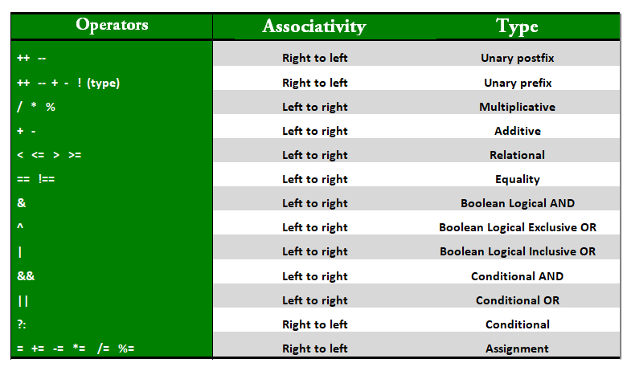

# <p align=center><b>Operators</b></p>

Java provides many types of operators which can be used according to the need. They are classified based on the functionality they provide.<br/>

Some of the types are:
1. [Arithmetic Operators][1]
2. [Unary Operators][2]
3. [Assignment Operator][3]
4. [Relational Operators][4]
5. [Logical Operators][5]
6. [Ternary Operator][6]
7. [Bitwise Operators][7]
8. [Shift Operators][7]
9. [Precedence and Associativity][7]
10. [Instance of operators][8]


<br/>

## Arithmetic Operators
They are used to perform simple arithmetic operations on primitive data types.

Symbol | Operator 
  ---: | :---
\*     | Multiplication
\/     | Division
%      | Modulo
\+     | Addition
–      | Subtraction
<br/>

## Unary Operators
Unary operators need only one operand. They are used to increment, decrement or negate a value.

Symbol | Operator 
  ---: | :---
–      | **Unary minus**, used for negating the values.
\+     | **Unary plus**, indicates positive value (numbers are positive without this, however). It performs an automatic conversion to int when the type of its operand is byte, char, or short. This is called unary numeric promotion.
++     | **Increment operator**, used for incrementing the value by 1. There are two varieties of increment operator.<br/> *Post-Increment:* Value is first used for computing the result and then incremented.<br/> *Pre-Increment:* Value is incremented first and then result is computed.
--     | **Decrement operator**, used for decrementing the value by 1. There are two varieties of decrement operator.<br/> *Post-decrement:* Value is first used for computing the result and then decremented.<br/> *Pre-Decrement:* Value is decremented first and then result is computed.
!      | **Logical NOT operator**, used for inverting a boolean value.
<br/>

## Assignment Operator
The operator is used to assign a value to any variable. It has a right to left associativity, i.e value given on right hand side of operator is assigned to the variable on the left and therefore right hand side value must be declared before using it or should be a constant.

Symbol | Operator 
  ---: | :---
=      | Assignment operator

#### Syntax:
```java
variable = value;
```

In many cases assignment operator can be combined with other operators to build a shorter version of statement called Compound Statement.
<br/>

#### Example:
```java
a = a + 5;
```

#### or:
```java
a += 5;
```

Symbol | Operator 
  ---: | :---
+=     | **adding left operand** with right operand and then assigning it to variable on the left.
-=     | **subtracting left operand** with right operand and then assigning it to variable on the left.
*=     | **multiplying left operand** with right operand and then assigning it to variable on the left.
/=     | **dividing left operand** with right operand and then assigning it to variable on the left.
%=     | **assigning modulo of left operand** with right operand and then assigning it to variable on the left.
<br/>

## Relational Operators
These operators are used to check for relations like equality, greater than, less than. They return boolean result after the comparison and are extensively used in looping statements as well as conditional if else statements.

#### Syntax: 
```java
variable relationOperator value
```

Some of the relational operators are:

Symbol | Operator 
  ---: | :--- 
==     | **Equal to:** returns true if left hand side is equal to right hand side.
!=     | **Not Equal to:** returns true if left hand side is not equal to right hand side.
<      | **less than:** returns true if left hand side is less than right hand side.
<=     | **less than or equal to:** returns true if left hand side is less than or equal to right hand side.
\>     | **Greater than:** returns true if left hand side is greater than right hand side.
\>=    | **Greater than or equal to:** returns true if left hand side is greater than or equal to right hand side.
<br/>

## Logical Operators
These operators are used to perform *"logical AND"* and *"logical OR"* operation, i.e. the function similar to AND gate and OR gate in digital electronics. One thing to keep in mind is the second condition is not evaluated if the first one is false, i.e. it has a short-circuiting effect. Used extensively to test for several conditions for making a decision.

Conditional operators are:

Symbol | Operator 
  ---: | :--- 
&&     | **Logical AND:** returns true when both conditions are true.
\|\|   | **Logical OR:** returns true if at least one condition is true.
<br/>

## Ternary operator
Ternary operator is a shorthand version of *IF-ELSE statement*. It has three operands and hence the name ternary. 

#### Syntax: 
```java
condition ? if true : if false
```

The above statement means that IF the condition evaluates to TRUE, then *execute* the statements *after* the **"?"** else *execute* the statements *after* the **":"**. 

#### Example:
```java
public class TernaryOperators
{
    public static void main(String... args)
    {
        int a = 20,
            b = 10,
            c = 30,
            result;
 
        result = (
            (a > b) ?
                (a > c) ? a : c
            :
                (b > c) ? b : c
        );
        
        System.out.println(
            "Max of three numbers is: " +result    // Output: 30
        );
    }
}
```
<br/>

## Bitwise Operators
These operators are used to perform manipulation of individual bits of a number. They can be used with any of the integer types. They are used when performing update and query operations of Binary indexed tree.

Symbol | Operator 
  ---: | :--- 
&      | **Bitwise AND operator:** returns bit by bit AND of input values.
\|     | **Bitwise OR operator:** returns bit by bit OR of input values.
^      | **Bitwise XOR operator:** returns bit by bit XOR of input values.
~      | **Bitwise Complement Operator:** This is a unary operator which returns the one’s compliment representation of the input value, i.e. with all bits inversed.
<br/>

## Shift Operators
These operators are used to shift the bits of a number left or right thereby multiplying or dividing the number by two respectively. They can be used when we have to multiply or divide a number by two. 

#### Syntax: 
```java
number shiftOperator numberOfPlacesToShift;
```

#### Example: 
```java
number << 1; // Each step multiply the value of 2 (the same as: number *= 2;)

number >> 4; // Each step divide the value of 2   (the same as: number := 8;)
```

Symbol | Operator 
  ---: | :--- 
<<     | **Left shift operator:** shifts the bits of the number to the left and fills 0 on voids left as a result. Similar effect as of multiplying the number with some power of two.
\>\>   | **Signed Right shift operator:** shifts the bits of the number to the right and fills 0 on voids left as a result. The leftmost bit depends on the sign of initial number. Similar effect as of dividing the number with some power of two.
\>\>\> | **Unsigned Right shift operator:** shifts the bits of the number to the right and fills 0 on voids left as a result. The leftmost bit is set to 0.
<br/>

## Precedence and Associativity of Operators
Precedence and associative rules are used when dealing with hybrid equations involving more than one type of operator. In such cases, these rules determine which part of the equation to consider first as there can be many different valuations for the same equation. The below table depicts the precedence of operators in decreasing order as magnitude with the top representing the highest precedence and bottom shows the lowest precedence.



<br/>

## Precedence and Associativity
There is often a confusion when it comes to hybrid equations that is equations having multiple operators. The problem is which part to solve first. There is a golden rule to follow in these situations. If the operators have different precedence, solve the higher precedence first. If they have same precedence, solve according to associativity, that is either from right to left or from left to right. Explanation of below program is well written in comments withing the program itself.

#### Example:
```java
public class PrecAndAssociatRules
{
    public static void main(String... args)
    {
        int a = 20,
            b = 10,
            c = 0,
            d = 20,
            e = 40,
            f = 30;
 
    /*
        * PRECEDENCE RULES
        * (if work will be next:)
        * First  step: B / D = 10 / 20 = 0.5
        * Second step: result(B/D) + A = 0.5 + 20 = 20.5 -> (int) -> 20
    */
        System.out.println(
            "The result of A + B / D is: " + (a + b / d)                    // Output: 20
        );
 
    /*
        * If the same precedence is followed as the associativity rules:
        * First  step: B * D = 10 * 20 = 200
        * Second step: E / F = 40 / 30 = 1.3(3)
        * Third  step: A + result(B*D) = 20 + 200 = 220
        * Fourth step: result(A+result(B*D)) - result(E/F) = 220 - 1.3(3) = 218.6(7) -> (int) -> 219
    */ 
        System.out.println(
            "The result of A + B * D - E / F is: " + (a + b * d - e / f)    // Output: 219
        );
    }
}
```
<br/>

## Be a Compiler
Compiler in our systems uses lex tool to match the greatest match when generating tokens. This creates a bit of a problem if overlooked.

* *For example*, consider the statement **A=B+++C;**, to many of the readers this might seem to create compiler error. But this statement is absolutely correct as the token created by lex are **A**, **=**, **B**, **++**, **+**, **C**.
* *Therefore* this statement has a similar effect of ***first assigning* B + C *to* A** and ***then incrementing* B**.
* *Similarly*, **A=B+++++C;** would generate error as tokens generated are **A**, **=**, **B**, **++**, **++**, **+**, **C** which IS actually AN ERROR as **there is no operand after second unary operand**. 

#### Example:
```java
public class operators
{
    public static void main(String... args)
    {
        int a = 20,
            b = 10,
            c = 0;
    
    /*
        *********************************************
        *       A=B+++C is compiled as B++ +C       *
        *                                           *
        * First  step:  B + C = 10 + 0 = 10         *
        * Second step:  A = result(B+C) = 10        *
        * Third  step:  B = B + 1 = 10 + 1 = 11     *
        *********************************************
    */

        System.out.println(
            "The result of:"   +     "\n\t" +
            "A = (B + C) is: " + a + "\n\t" +   // Output: 10
            "B = (B + 1) is: " + b + "\n\t" +   // Output: 11
            "C is: "           + c              // Output: 0
        );

    /*
        *********************************************
        * A=B+++++C is compiled as  B++ ++ +C       *
        *           which GIVES ERROR!              *
        *                                           *
        * Uncommente the line below to check this   *
        *********************************************
    */

        // System.out.println(b+++++c);

    }
}
```
<br/>

## *Using* **"+"** *over the* **"( )"**
When *using **+** operator inside system.out.println()* make sure to do addition using parenthesis.
<br/>
If we write something before doing addition, then string addition takes place, that is associativity of addition is left to right and hence integers are added to a string first producing a string, and string objects concatenate when using +, therefore it can create unwanted results. 

#### Example:
```java
public class AdditionAndConcatenation
{
    public static void main(String... args)
    {
 
        int x = 5,
            y = 8;
    
    /*
        *****************************************************
        * A line will be printed, then added 5 and then 8   *
        * (without spaces), which will be concatenated      *
        * into the next line:                               *
        *                                                   *
        *       "Concatenation (X + Y) = 58"                *
        *****************************************************
    */

        System.out.println(
            "Concatenation (X + Y) = "  + x + y     // Output: 58
        );
 
        System.out.println(
            "Addition (X + Y) = "       + (x + y)   // Output: 13
        );
    }
}
```
<br/>

## Instance of operator
Instance of operator is used for type checking. It can be used to test if an object is an instance of a class, a subclass or an interface.

#### Syntax: 
```java
object instanceof class/subclass/interface
```

#### Example:
```java
public class InstanceOperators
{
    public static void main(String... args)
    {
        Person obj1 = new Person();
        Person obj2 = new Boy();
 
        // As obj is of type person, it is not an instance of Boy or interface
        System.out.println(
            "obj1 instanceof Person: "      + (obj1 instanceof Person)      // Output: true
        );
        System.out.println(
            "obj1 instanceof Boy: "         + (obj1 instanceof Boy)         // Output: false
        );
        System.out.println(
            "obj1 instanceof MyInterface: " + (obj1 instanceof MyInterface) // Output: false
        );
 
        // Since obj2 is of type boy, whose parent class is person and it implements the 
        // interface Myinterface it is instance of all of these classes
        System.out.println(
            "obj2 instanceof Person: "      + (obj2 instanceof Person)      // Output: true
        );
        System.out.println(
            "obj2 instanceof Boy: "         + (obj2 instanceof Boy)         // Output: true
        );
        System.out.println(
            "obj2 instanceof MyInterface: " + (obj2 instanceof MyInterface) // Output: true
        );
    }
}
 
class Person
{

}
 
class Boy extends Person implements MyInterface
{

}
 
interface MyInterface
{

}
```

<!--
* [Arithmetic Operators][1]
* [Unary Operators][2]
* [Assignment Operator][3]
* [Relational Operators][4]
* [Logical Operators][5]
* [Ternary Operator][6]
* [Bitwise Operators][7]
* [Shift Operators][7]
* [Precedence and Associativity][7]
* [Instance of operators][8]
  -->

[1]: https://www.geeksforgeeks.org/java-arithmetic-operators-with-examples/
[2]: https://www.geeksforgeeks.org/java-unary-operator-with-examples/
[3]: https://www.geeksforgeeks.org/java-assignment-operator-with-examples/
[4]: https://www.geeksforgeeks.org/java-relational-operators-with-examples/
[5]: https://www.geeksforgeeks.org/java-logical-operators-with-examples/
[6]: https://www.geeksforgeeks.org/java-ternary-operator-with-examples/
[7]: https://www.geeksforgeeks.org/operators-in-java/?ref=lbp
[8]: https://www.geeksforgeeks.org/java-instanceof-and-its-applications/

---
<br/>