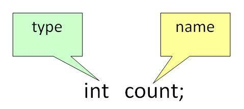
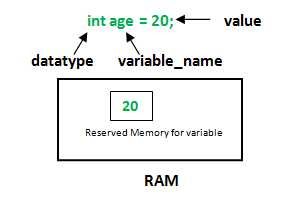

# <p align=center><b>Variables in Java</b></p>

A variable is a name given to a memory location. It is the basic unit of storage in a program.

### Common features:
* The value stored in a variable can be changed during program execution.
* A variable is only a name given to a memory location, all the operations done on the variable effects that memory location.
* In Java, all the variables must be declared before use.

### The declaration of variables:



From the image, it can be easily perceived that while declaring a variable we need to take care of two things  that while de

### **The declaration:**

***Datatype:*** Type of data that can be stored in this variable.<br/>
***Dataname:*** Name given to the variable. In this way, a name can only be given to a memory location. It can be assigned values in two ways:

* Variable Initialization
* Assigning value by taking input

### **The initialization:**

* **datatype:** Type of data that can be stored in this variable. 
* **variable_name:** Name given to the variable. 
* **value:** It is the initial value stored in the variable.



#### Examples:
```java
// Declaring
float simpleInterest;

// Declaring and Initializing
int   time = 10,
     speed = 20;

char   var = 'h'; 
```

## **Different types of variables:**
1. Local Variables
2. Instance Variables
3. Static Variables

### **Local** Variables
A variable defined within a block or method or constructor is called a local variable. 
* These variables are created when the block is entered or the function is called and destroyed after exiting from the block or when the call returns from the function.
* The scope of these variables exists only within the block in which the variable is declared. i.e. we can access these variables only within that block.
* Initialization of the local variable is mandatory before using it in the defined scope.

### **Instance** Variables
Instance variables are non-static variables and are declared in a class outside any method, constructor and etc. 
* As instance variables are declared in a class, these variables are created when an object of the class is created and destroyed when the object is destroyed.
* Unlike local variables, we may use access specifiers for instance variables. If we do not specify any access specifier then the default access specifier will be used.
* Initialization of Instance Variable is not Mandatory. Its default value is 0
* Instance Variable can be accessed only by creating objects.

### **Static** Variables
Static variables are also known as Class variables. 
* These variables are declared similarly as instance variables, the difference is that static variables are declared using the static keyword within a class outside any method constructor or block.
* Unlike instance variables, we can only have one copy of a static variable per class irrespective of how many objects we create.
* Static variables are created at the start of program execution and destroyed automatically when execution ends.
* Initialization of Static Variable is not Mandatory. Its default value is 0
* If we access the static variable like the Instance variable (through an object), the compiler will show the warning message and it won’t halt the program. The compiler will replace the object name with the class name automatically.
* If we access the static variable without the class name, the compiler will automatically append the class name.

### Differences between the *Instance* and the *Static* variables
* Each object will have its own copy of the instance variable whereas We can only have one copy of a static variable per class irrespective of how many objects we create.
* Changes made in an instance variable using one object will not be reflected in other objects as each object has its own copy of the instance variable. In the case of static, changes will be reflected in other objects as static variables are common to all objects of a class.
* We can access instance variables through object references and Static Variables can be accessed directly using class name.

#### **Syntax:** Static and instance variables:
```java
static int a;   // Static variable
       int b;   // Instance variable
```
---
<br/>
